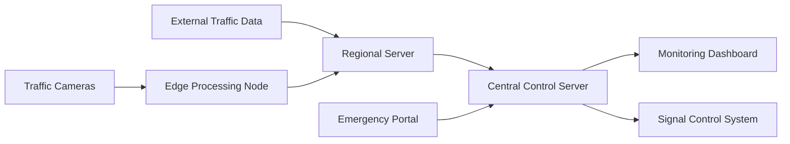
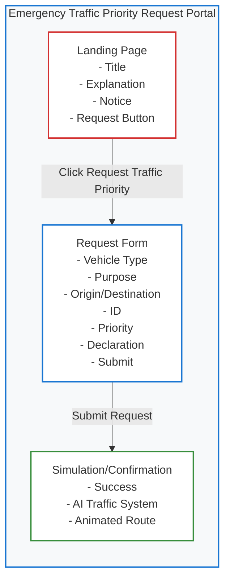

# ReDirect – AI Powered Smart Traffic Optimization System

## System Overview
ReDirect is a practical, scalable traffic management prototype for Municipal Corporation of Delhi. It ingests live vehicle counts from existing camera feeds, calculates density using road characteristics and historical congestion, optimizes green times every 30 seconds, and prioritizes emergency corridors.

## Architecture Diagram


## Project Folder Structure
```
.
├── ai
│   ├── detection.py
│   └── requirements.txt
├── backend
│   ├── app
│   │   ├── api
│   │   │   └── routes.py
│   │   ├── core
│   │   │   └── config.py
│   │   ├── db
│   │   │   ├── models.py
│   │   │   ├── schema.sql
│   │   │   └── session.py
│   │   ├── services
│   │   │   ├── density.py
│   │   │   ├── emergency.py
│   │   │   └── optimization.py
│   │   ├── main.py
│   │   └── schemas.py
│   ├── sample_data
│   │   └── seed.sql
│   ├── .env.example
│   ├── Dockerfile
│   └── requirements.txt
├── edge
│   ├── edge_config.json
│   ├── edge_processor.py
│   ├── Dockerfile
│   └── requirements.txt
├── frontend
│   ├── src
│   │   ├── api.js
│   │   ├── App.jsx
│   │   ├── main.jsx
│   │   └── styles.css
│   ├── Dockerfile
│   ├── index.html
│   ├── package.json
│   └── vite.config.js
├── docker-compose.yml
└── README.md
```

## Backend Implementation
- FastAPI service with traffic ingest, intersection registry, signal plan generation, and emergency corridor activation.
- PostgreSQL schema aligned with real-time monitoring and historical storage.

## AI Detection Code
- YOLOv8 inference using OpenCV.
- Outputs vehicle_count, vehicle_type_distribution, emergency_detected.

## Traffic Optimization Algorithm
- Density score uses vehicle count, lane count, road width, priority weight, and historical congestion.
- Queue-based prioritization assigns green times between 20s and 90s.
- Signal updates supported every 30 seconds.

## Emergency Corridor Logic
- Supports vision-based emergency detection and portal submissions.
- Generates sequential green windows across intersections.

## React Dashboard
- Government-style interface with live density status, signal plans, emergency routes, and camera feed placeholders.

## Database Schema
See [schema.sql](file:///d:/Projects/prototype/backend/app/db/schema.sql).

## Deployment Guide
1. Install Docker and Docker Compose.
2. Run `docker compose up --build`.
3. Load sample intersections with `backend/sample_data/seed.sql`.
4. Access dashboard at `http://localhost:5173`.
5. Access API at `http://localhost:8000/docs`.

## Future Scalability Plan
- Edge nodes for intersections and corridor detection.
- Regional aggregation servers for zone-level optimization.
- Central command for citywide monitoring and policy control.

## Emergency Traffic Priority Request Portal – User Flow



### Portal Features (2026 Update)
- Clean, professional, mobile-responsive React UI
- Landing page with government notice and explanation
- Structured emergency request form with validation and dynamic fields
- Animated simulation/confirmation screen
- No backend required for prototype
- All sensitive data protected; only government can access real requests in production
