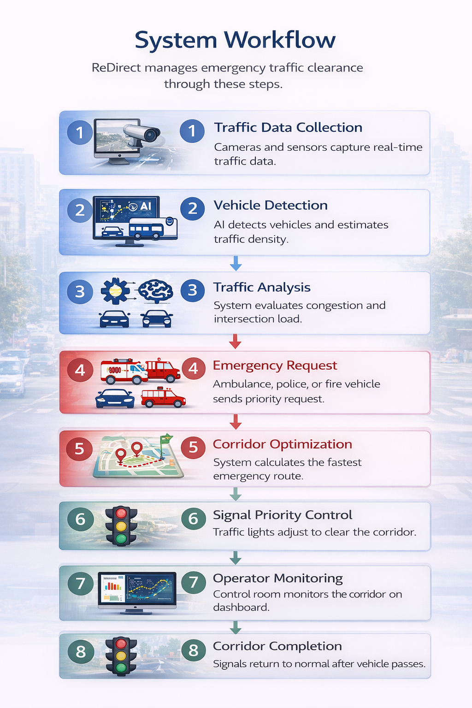
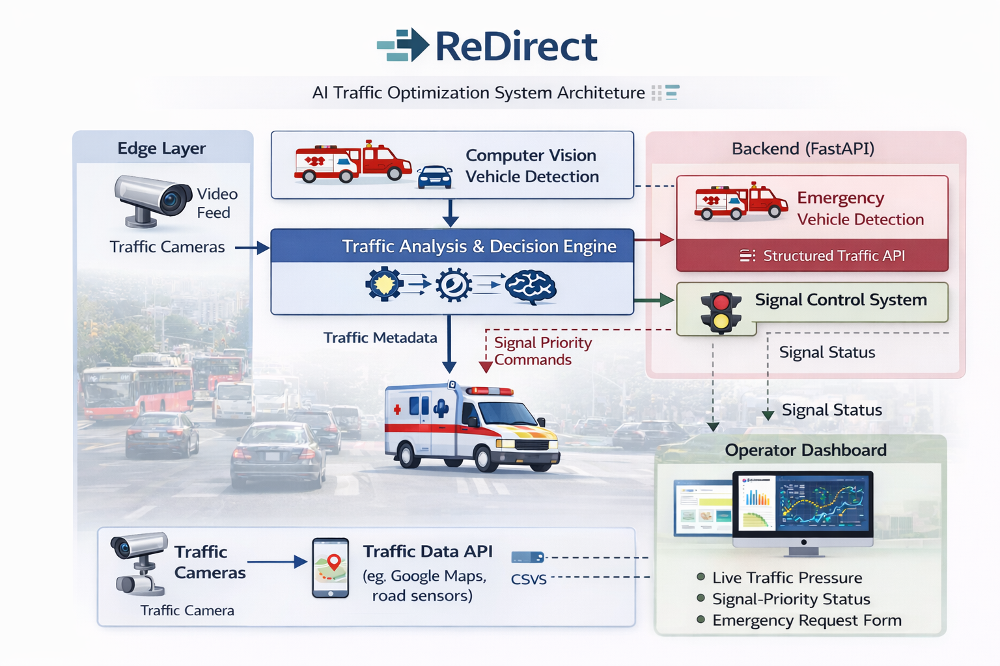
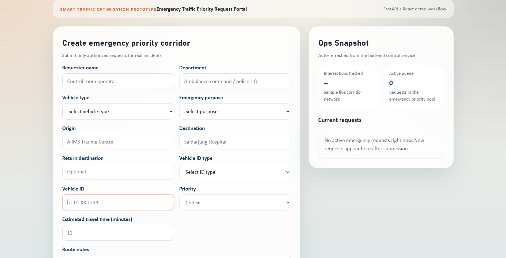

# ReDirect

ReDirect is an AI-driven traffic optimization prototype designed to help traffic control centers create faster emergency corridors while maintaining smooth traffic flow across major intersections.

The system combines intelligent congestion prediction, adaptive signal control, and emergency vehicle priority routing to improve response times for ambulances, police, and fire services.

---

# System Workflow



The workflow demonstrates how emergency traffic clearance is handled:

1. Emergency vehicle submits a priority request.
2. The backend analyzes traffic density and congestion levels.
3. AI-based optimization calculates the fastest corridor.
4. Traffic signals along the route receive priority instructions.
5. The control dashboard confirms the emergency corridor activation.

---

# System Architecture



ReDirect follows a lightweight modular architecture:

- **Edge Layer**  
  Processes vehicle metadata from cameras or sensors.

- **AI Layer**  
  Performs vehicle detection, density scoring, and congestion prediction.

- **Backend Layer (FastAPI)**  
  Handles emergency requests, signal optimization, and API services.

- **Frontend Layer (React Portal)**  
  Provides a dashboard for operators to monitor traffic and manage emergency requests.

---

# Dashboard Preview



The operator portal provides:

- Live signal-priority cards
- Emergency request submission form
- Corridor confirmation timeline
- Real-time traffic pressure indicators

---

# Core Features

### Emergency Priority Routing
Emergency vehicles can request traffic clearance through a dedicated portal.  
The system generates optimized signal corridors to ensure faster movement.

### AI-Based Traffic Optimization
ReDirect simulates congestion prediction and traffic density analysis to recommend adaptive signal timings.

### Emergency Traffic API
A structured backend API provides traffic snapshots and emergency request tracking for dashboard integration.

### Edge-Friendly Processing
Instead of heavy video pipelines, the system processes lightweight vehicle metadata from edge devices.

---

# Improvements in This Version

### Frontend

- redesigned React operator portal
- signal priority cards
- emergency request workflow
- built-in preview route

### Backend

- structured request schemas
- dashboard snapshot endpoint
- emergency request lifecycle tracking
- automatic TTL cleanup
- environment-based API configuration

### Repository Optimization

Unnecessary files are no longer tracked:

- `.env`
- local databases
- caches
- `node_modules`
- generated build files

---

# Project Structure

```text
.
|-- ai
|   `-- detection.py
|-- backend
|   |-- app
|   |   |-- api
|   |   |   `-- routes.py
|   |   |-- core
|   |   |   `-- config.py
|   |   |-- db
|   |   |   `-- models.py
|   |   |-- services
|   |   |   |-- density.py
|   |   |   |-- emergency.py
|   |   |   `-- optimization.py
|   |   |-- main.py
|   |   `-- schemas.py
|   |-- .env.example
|   |-- requirements.txt
|   `-- run.py
|-- docs
|-- edge
|   `-- edge_processor.py
|-- frontend
|   |-- src
|   |   |-- App.jsx
|   |   |-- api.js
|   |   |-- main.jsx
|   |   `-- styles.css
|   |-- index.html
|   |-- package.json
|   `-- vite.config.js
`-- README.md
```

---

# Running the Project Locally

## Backend

```bash
cd backend
python -m venv .venv
.venv\Scripts\activate
pip install -r requirements.txt
copy .env.example .env
uvicorn app.main:app --reload
```

Backend runs at:

```
http://localhost:8000
```

---

## Frontend

```bash
cd frontend
npm install
npm run dev
```

Frontend runs at:

```
http://localhost:5173
```

---

# Preview and API Docs

Preview served by backend:

```
http://localhost:8000/preview
```

API documentation:

```
http://localhost:8000/docs
```

---

# Core API Endpoints

- `GET /health`
- `GET /preview`
- `GET /api/v1/dashboard`
- `POST /api/v1/emergency/requests`
- `GET /api/v1/emergency/requests`
- `GET /api/v1/gov/emergency/active`
- `POST /api/v1/emergency/alert`

---

# Prototype Notes

- The backend uses an in-memory store to keep the prototype lightweight.
- Signal recommendations are based on simulated vehicle counts and density scoring.
- AI and edge modules demonstrate how traffic metadata can be summarized before reaching the control system.

---

# Documentation

- [Government evaluation notes](docs/government_evaluation.md)
- [Project proposal](docs/samadhan_saathi_proposal.md)
