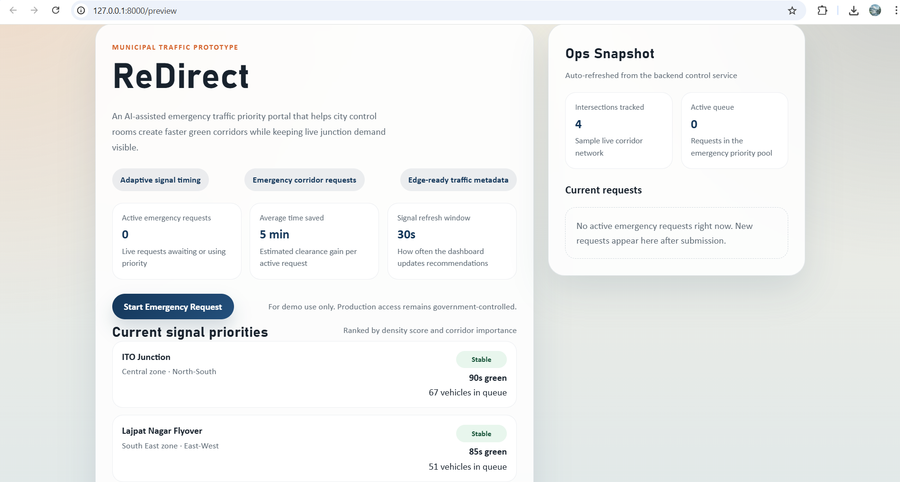
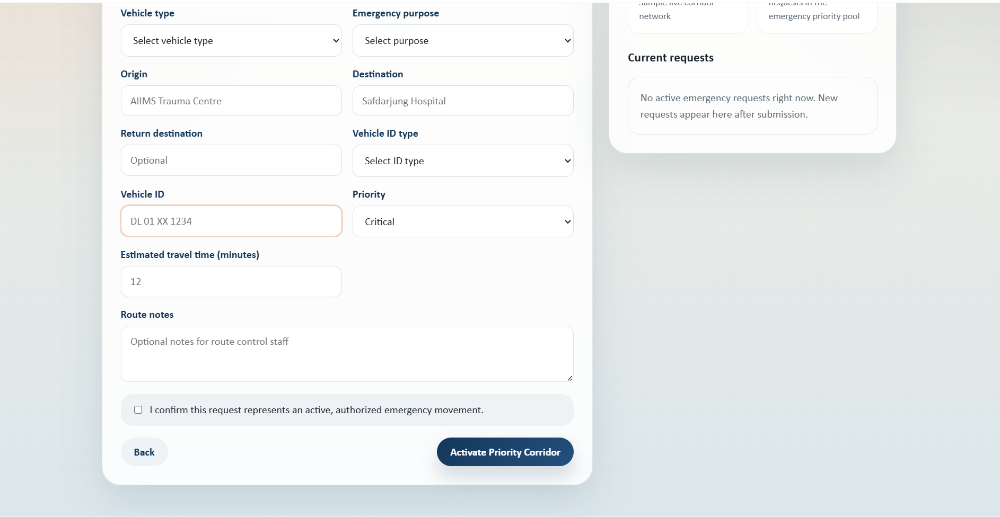

# ReDirect

ReDirect is an AI-assisted traffic optimisation prototype for city control rooms. It is designed to reduce day-to-day congestion across important intersections and also support faster emergency movement for ambulances, police, and fire services.

The current version keeps the same project concept, but improves how decisions are made:

- nearby intersections are checked first within a `20 km` radius
- vehicle motion direction is used to decide whether traffic is actually moving toward a target area
- normal signal timing uses the same logic as emergency routing
- emergency corridors are generated on top of the live network optimisation instead of using a separate isolated flow

## What Is New In This Version

- Direction-aware traffic optimisation for the regular dashboard signal plan
- Incoming pressure scoring based on nearby intersections and inbound vehicle flow
- Radius-first prioritisation so close intersections are handled before the remaining network
- Direction-aware emergency corridor sequencing
- Updated dashboard preview showing inbound pressure and flow direction context
- Cleaner repository structure and preview-ready FastAPI + React demo

## Why This Matters

Most traffic systems only react to queue length at one junction. ReDirect now looks one step wider:

1. It checks nearby intersections.
2. It estimates whether vehicles are actually feeding into a target junction.
3. It prioritises intersections where traffic is both close and moving toward that area.
4. It then adjusts signal recommendations for normal traffic and emergency requests.

This makes the prototype closer to a practical control-room workflow instead of a corridor-only demo.

## System Workflow

### General Traffic Optimisation

1. The backend simulates live vehicle counts for each intersection.
2. Density scoring is calculated from lane count, road width, and congestion history.
3. Nearby intersections inside the `20 km` radius are checked.
4. Vehicle motion direction is used to estimate inbound traffic pressure.
5. Signal priority and green timings are updated using both density and directional flow.

### Emergency Movement Workflow

1. An operator submits an emergency request.
2. The backend resolves the closest relevant intersection context from the route.
3. Intersections within the nearby radius are prioritised first.
4. Their vehicle flow direction is checked to see whether traffic is moving into the corridor zone.
5. A staged green corridor is generated, followed by the remaining intersections.

## Visual Overview

### System Flow


### System Architecture


### Dashboard Preview





The dashboard now highlights:

- live signal-priority cards
- incoming traffic pressure per intersection
- dominant inbound direction from nearby intersections
- emergency request submission and confirmation flow
- corridor sequence reasoning with radius-first and movement-alignment details

## Core Features

### Network-Wide Traffic Optimisation

ReDirect continuously ranks intersections using:

- density score
- road importance
- public transport weight
- nearby inbound traffic pressure
- vehicle movement direction

### Direction-Aware Decision Logic

The system does not treat all nearby vehicles equally. It checks whether detected traffic is:

- moving toward the target area
- mostly cross traffic
- moving away from the target area

That makes prioritisation more realistic for both daily traffic balancing and emergency routing.

### Emergency Corridor Planning

Emergency requests still remain a core part of the project. The difference is that corridor generation now reuses the same live optimisation model used by the dashboard.

### Edge-Friendly Design

The project is built around lightweight vehicle metadata rather than heavy full-video processing, making it easier to imagine edge-device deployment.

## Optimisation Logic

### Inputs Used

- live vehicle count
- lane count
- road width
- historical congestion
- road priority weight
- movement profile by direction

### Decision Layers

1. `density.py` computes congestion pressure.
2. `network_flow.py` estimates inbound pressure from nearby intersections.
3. `optimization.py` combines density and directional pressure into signal priority.
4. `intersection_priority.py` applies radius-first and motion-aware ordering for corridor logic.
5. `emergency.py` turns the ranked intersections into staged green windows.

## Project Structure

```text
.
|-- ai
|   `-- detection.py
|-- backend
|   |-- app
|   |   |-- api
|   |   |   `-- routes.py
|   |   |-- core
|   |   |   `-- config.py
|   |   |-- db
|   |   |   `-- models.py
|   |   |-- services
|   |   |   |-- density.py
|   |   |   |-- emergency.py
|   |   |   |-- intersection_priority.py
|   |   |   |-- network_flow.py
|   |   |   `-- optimization.py
|   |   |-- main.py
|   |   `-- schemas.py
|   |-- .env.example
|   |-- requirements.txt
|   `-- run.py
|-- docs
|-- edge
|   `-- edge_processor.py
|-- frontend
|   |-- src
|   |   |-- App.jsx
|   |   |-- api.js
|   |   |-- main.jsx
|   |   `-- styles.css
|   |-- index.html
|   |-- package.json
|   `-- vite.config.js
`-- README.md
```

## Running The Project Locally

### Backend

```bash
cd backend
python -m venv .venv
.venv\Scripts\activate
pip install -r requirements.txt
copy .env.example .env
python -m uvicorn app.main:app --reload --host 127.0.0.1 --port 8000
```

Backend:

```text
http://127.0.0.1:8000
```

### Frontend Dev Server

```bash
cd frontend
npm install
npm run dev
```

Frontend:

```text
http://127.0.0.1:5173
```

### Built-In Preview

The backend can also serve the built frontend preview directly:

```text
http://127.0.0.1:8000/preview
```

### API Docs

```text
http://127.0.0.1:8000/docs
```

## Core API Endpoints

- `GET /health`
- `GET /preview`
- `GET /api/v1/dashboard`
- `POST /api/v1/emergency/requests`
- `GET /api/v1/emergency/requests`
- `GET /api/v1/gov/emergency/active`
- `POST /api/v1/emergency/alert`

## Current Prototype Notes

- The backend currently uses in-memory storage for active emergency requests.
- Live traffic values are simulated for demo purposes.
- Directional movement is represented using structured motion profiles in the sample network.
- The AI and edge folders show how metadata can feed the traffic control layer without requiring a heavy production deployment.

## Documentation

- [Government evaluation notes](docs/government_evaluation.md)
- [Project proposal](docs/samadhan_saathi_proposal.md)
